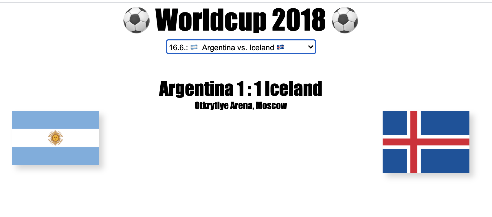

# Worldcup 2018
simple Client for GraphQL Exercise made with koa

**Usage**

choose a Match from a dropdown list and look at the result (work in progress).


**GraphQL Server Settings**
  - defined in `./public/js/script.js` (defaults to `http://localhost:4000`).

**Client Settings**
  - defined in `index.js` (defaults to `http://localhost:3000`)

Both servers must be running (just saying...)
following queries will be send to the GraphQL server:
```
  {
    getMatches {
      id
      date
      home_team {
        name
        emoji_string
      }
      away_team {
        name
        emoji_string
      }
    }
  }
  // -> should return an array of all matches
```

```
   {
    getMatch (id:${id}) {
      id
      date
      home_score
      away_score
      home_penalty
      away_penalty
      winner
      loser
      home_scorers
      away_scorers
      stadium {
        name
        city
      }
      home_team {
        name
        emoji_string
        flag
      }
      away_team {
        name
        emoji_string
        flag
      }
    }
  }
  // -> should return details for one Match
```